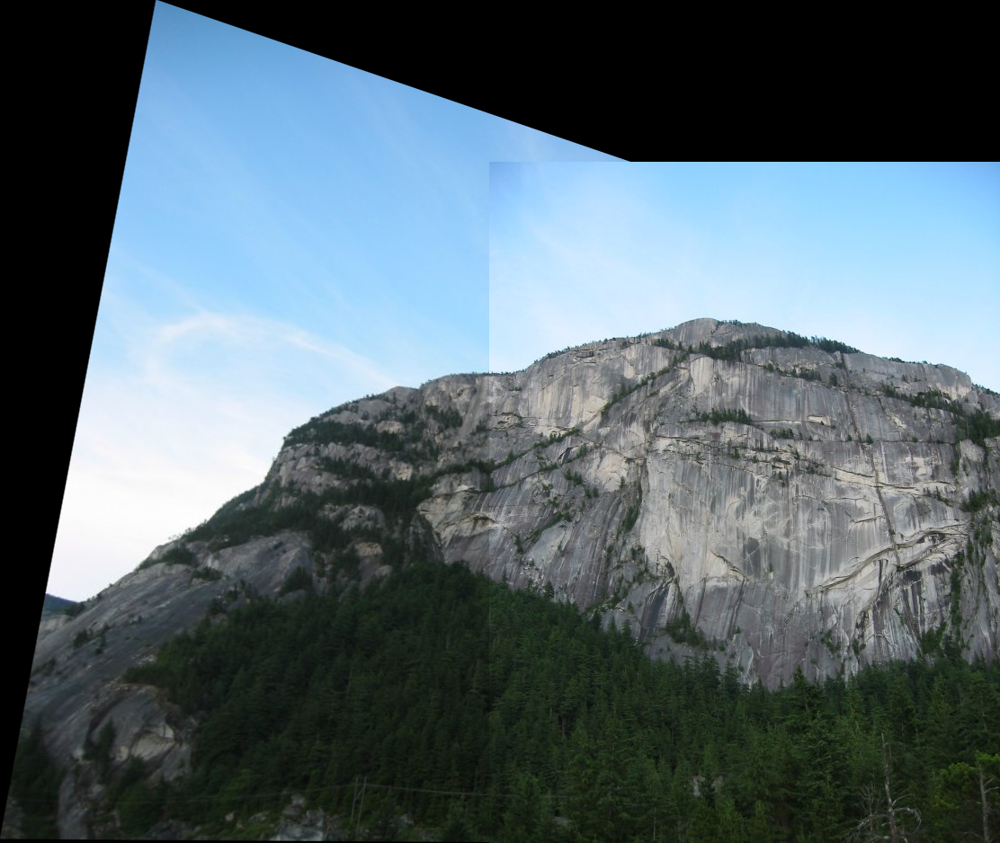

# My AutoPano

## Overview

| **Phase 1 Results Overview** |  |
|----------|----------|
|  |  |
| Result Set 1  | Results Set 2  |

| **Phase 2 Results Overview:** |  |
|----------|----------|
| **Ground Truth: Green & Prediction: Blue**| **Ground Truth: Green & Prediction: Blue** |
|  |  |
| Unsupervised Model | Unsupervised Model  |
|  |  |
| Supervised Model | Supervised Model  |

My AutoPano is a project that explores panoramic image stitching through the integration of two distinct methodologies: Classical Computer Vision and Deep Learning. The primary objective is to seamlessly merge two or more images by leveraging repeated local features to create cohesive panoramas.

## Abstract
This project presents a comprehensive exploration of panoramic image stitching through two phases:

1. **Phase 1**: Traditional Computer Vision Techniques
2. **Phase 2**: Deep Learning Techniques

Both approaches aim to construct a homography matrix between two images by applying corner detection, feature matching, and image warping and blending.

## Phase 1: Traditional Approach

### Corner Detection
- Utilizes Harris Corners for identifying corners in greyscale images.
- Implementation: `cv2.cornerHarris`

### Adaptive Non-Maximal Suppression (ANMS)
- Refines the detected corners to distribute them evenly across the image.
- Reduces artifacts in the warping process.

### Feature Descriptors
- Describes feature points using a numerical representation.
- Extracts 40x40 pixel patches around feature points, applies Gaussian blur, and samples to 8x8 patches.

### Feature Matching
- Aligns features of two images using the sum of squared differences.
- Retains the best matching pairs with a predetermined threshold.

### Random Sampling Consensus (RANSAC)
- Removes incorrect matches to compute a robust homography matrix.
- Implementation: `cv2.getPerspectiveTransform` and `cv2.findHomography`

### Warping and Stitching Images
- Warps and blends images using the homography matrix.
- Implementation: `cv2.warpPerspective`

### Results and Conclusion
- Demonstrates the correctness of homography estimation through generated panoramas.
- Highlights the need for better blending techniques for smooth panoramas.

## Phase 2: Deep Learning Approach

### Data Generation
- Generates synthetic data using a small subset of the MSCOCO dataset.
- Creates patches and calculates homographies for training.

### Supervised Model
- Utilizes a Convolutional Neural Network (CNN) for homography prediction.
- Structure: 8 convolutional layers with batch normalization and ReLU activation.
- Loss Function: Mean Squared Error (MSE)

### Unsupervised Model
- Estimates homographies without explicit ground truth labels.
- Structure: Similar CNN architecture with additional warping using Kornia.
- Loss Function: L1 loss

### Deep Learning Stitching
- Uses trained models to create panoramic images from stitched patches.
- Combines images sequentially and resizes the output.

### Results and Outcomes
- Compares the performance of supervised and unsupervised models.
- Provides stitched images for different test sets, demonstrating the robustness of deep learning approaches.

## References
1. DeTone, D., Malisiewicz, T., & Rabinovich, A. (2016). Deep Image Homography Estimation.
2. Nguyen, T., Chen, S. W., Shivakumar, S. S., Taylor, C. J., & Kumar, V. (2018). Unsupervised Deep Homography: A Fast and Robust Homography Estimation Model.

## Contact
For any inquiries, please contact:
- Abhijeet Sanjay Rathi: asrathi@wpi.edu
